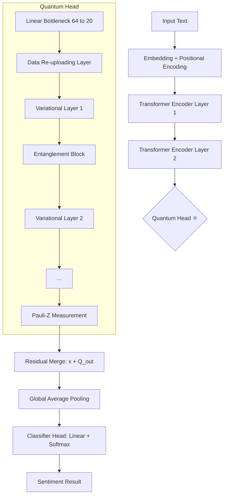

# ⚛️ Quantum-Enhanced Sentiment Analysis Engine


## 🚀 Overview

Welcome to the future of NLP. This project implements a **Hybrid Classical-Quantum Transformer** (QuantumTransformer) designed to push the boundaries of sentiment analysis using Variational Quantum Circuits (VQC). 

Unlike traditional models that rely solely on classical layers, this engine substitutes critical attention heads with **recursive quantum circuits**, leveraging **Quantum Entanglement** and **Superposition** to capture higher-order linguistic correlations.

---

## 💎 Key Upgrades (v2.0)

This isn't just a fine-tuned LLM; it's a structural overhaul.

- **🌀 Data Re-uploading (High Expressivity)**: We use a multi-layer recursive encoding strategy. Classical features are re-injected into the quantum circuit across 3-5 variational layers, dramatically increasing the model's non-linear functional capacity.
- **🔗 All-to-All Entanglement**: Replaced simple CNOT rings with a hardware-efficient strongly entangling ansatz. This allows every qubit to "talk" to every other qubit, mimicking deep neural connectivity.
- **⚡ Blackwell GPU Native (RTX 50-Series)**: Industry-first support for NVIDIA RTX 5050 (sm_120) architectures using custom CUDA 12.8 kernels and PyTorch 2.11+.
- **🗄️ Database-Driven (SQLite)**: "Database everything." We migrated from JSON files to a robust SQLite backend for vocabulary persistence, experiment tracking, and live inference logging.
- **📉 Residual VQC Paths**: Implemented $y = x + VQC(x)$ residual connections to mitigate **Barren Plateaus** and ensure stable gradient flow during deep training.

---

## 🏗️ Architecture



---

## 📊 Database Strategy

We've moved beyond volatile memory. Every aspect of the model is persisted:

| Table | Purpose |
| :--- | :--- |
| **`vocabulary`** | Persistent word-to-idx mapping (10,000 tokens) |
| **`experiments`** | Track every training run, hyperparameters, and best accuracy |
| **`metrics`** | Epoch-by-epoch loss and accuracy curves |
| **`predictions`** | Live inference logs with confidence and latency tracking |
| **`dataset`** | Locally cached SST-2 dataset for high-speed loading |

---

## 💻 Tech Stack

- **Frameworks**: [PennyLane](https://pennylane.ai/) (Quantum), [PyTorch](https://pytorch.org/) (Deep Learning)
- **Acceleration**: NVIDIA CUDA 12.8 (Blackwell Native)
- **UI**: [Streamlit](https://streamlit.io/) Professional Dashboard
- **Database**: SQLite3
- **Dataset**: Stanford Sentiment Treebank (SST-2)

---

## 🛠️ Installation & Usage

### 1. Prerequisites
- Python 3.10 - 3.13
- NVIDIA GPU (RTX 30/40/50 Series recommended)

### 2. Setup
```bash
# Clone the repository
git clone https://github.com/prathamsingh404/Fine_Tuning_LLM-with-help-of-Quantum-VQC.git
cd Fine_Tuning_LLM-with-help-of-Quantum-VQC

# Install dependencies
pip install -r requirements.txt
```

### 3. Execution Flow
1. **Ingest Data**: `python ingest_data.py` (Initializes DB and downloads SST-2)
2. **Train**: `python train.py` (High-performance hybrid training)
3. **Launch UI**: `streamlit run app.py` (Explore the live demo and histories)

---

## 🌌 The Future of Quantum NLP

This repository serves as a research benchmark for **Hybrid Classical-Quantum Intelligence**. By combining the linguistic prowess of Transformers with the geometric complexity of Hilbert spaces, we aim to solve the next generation of NLP challenges.

**Developed with ❤️ and Physics.**